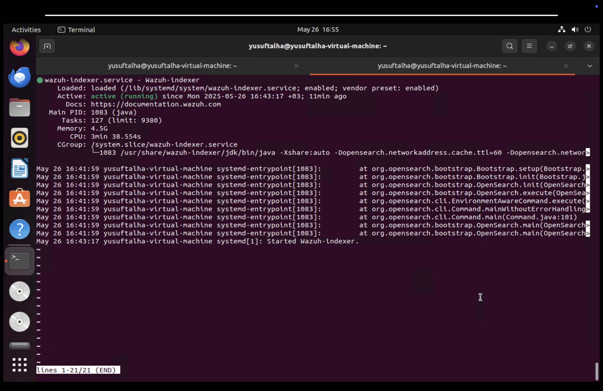
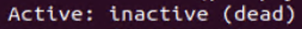
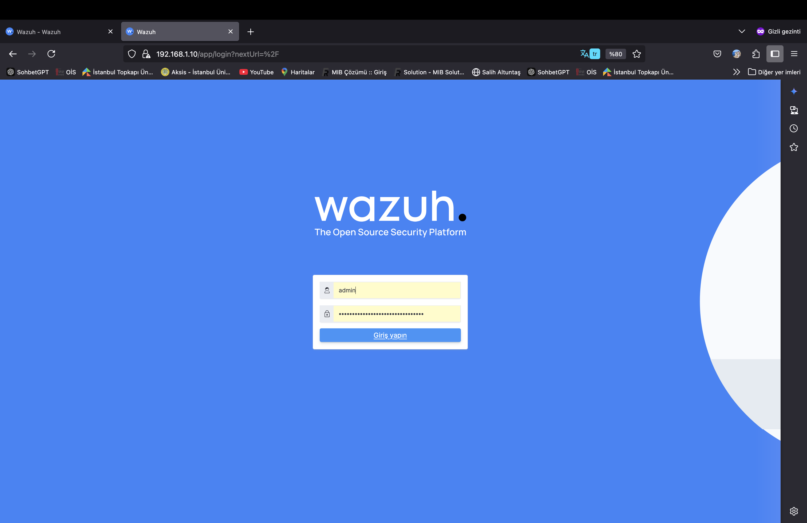
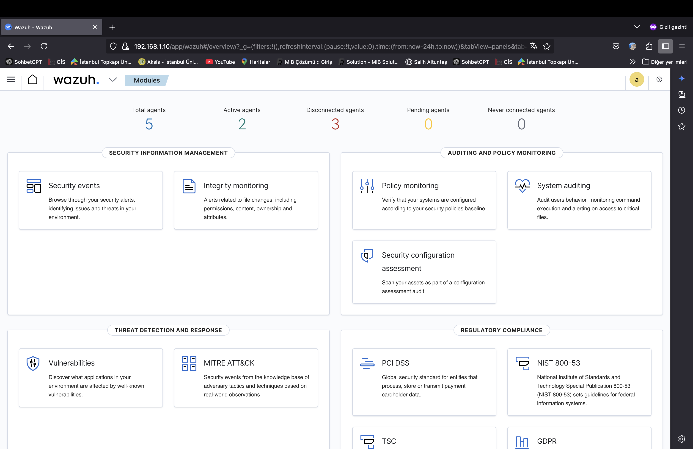
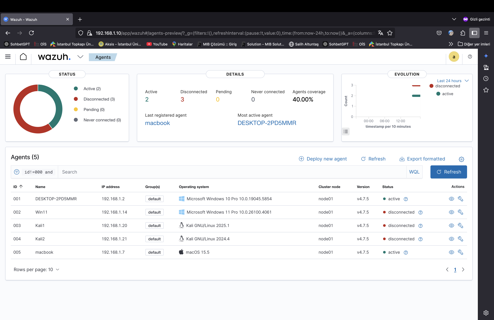
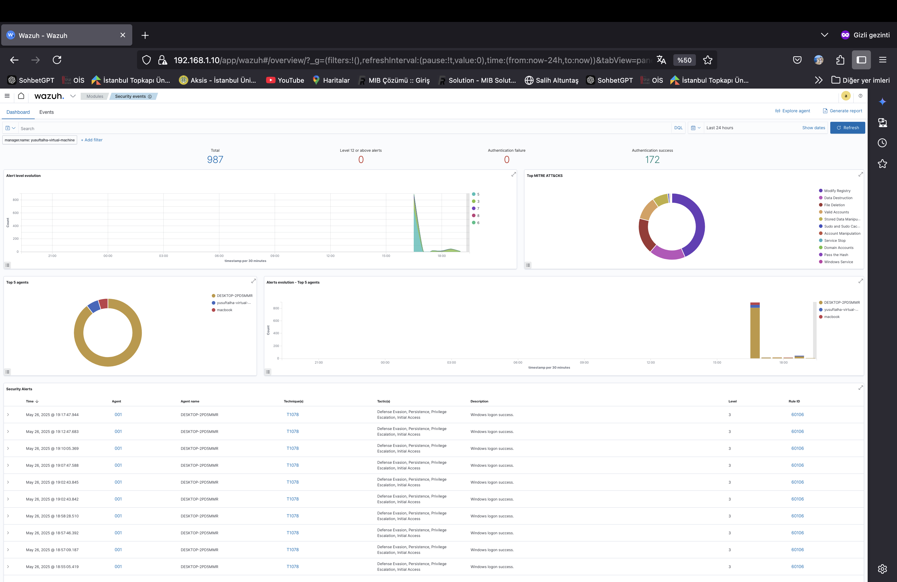
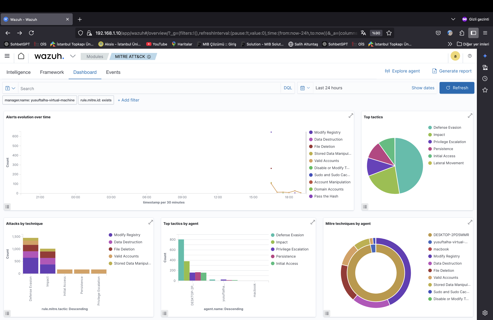
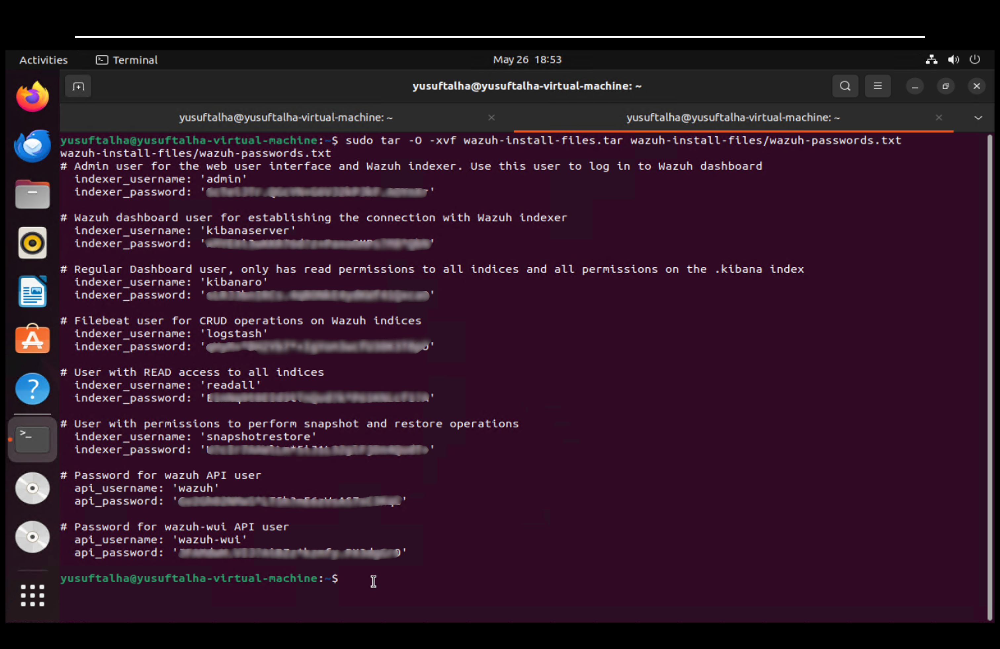
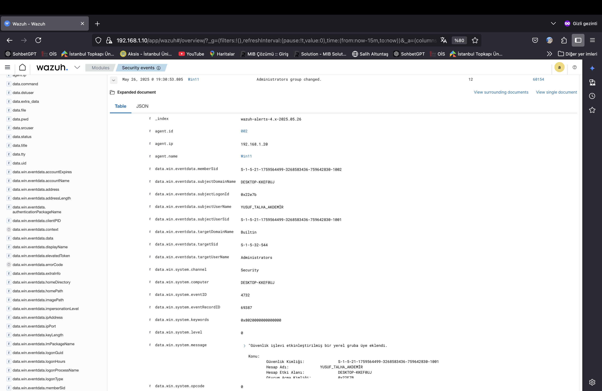
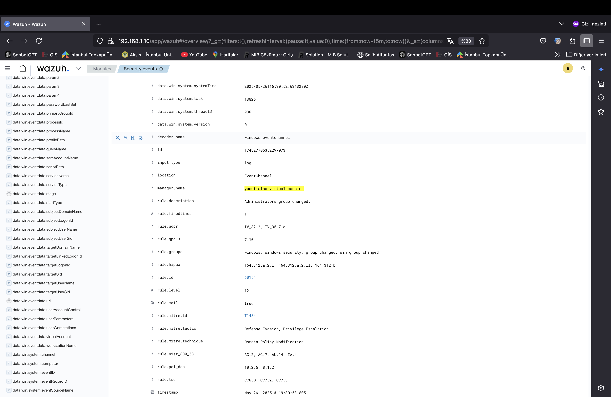

# 🛡️ Wazuh ile SIEM Ortamı Kurulumu ve Olay Simülasyonu

Bu proje, bir güvenlik operasyon merkezi (SOC) senaryosuna benzer şekilde, Wazuh kullanarak bir SIEM (Security Information and Event Management) ortamı kurmayı ve çeşitli güvenlik olaylarını simüle etmeyi amaçlamaktadır.

## 📌 İçerik

* [Ortam Mimarisi](#ortam-mimarisi)
* [Kurulum Aşamaları](#kurulum-aşamaları)

  * [Wazuh Sunucusu Kurulumu](#1-wazuh-sunucusu-kurulumu)
  * [Ajan Kurulumu ve Kaydı](#2-ajan-kurulumu-ve-kaydı)
* [Senaryo 1: Yeni Admin Kullanıcısı Oluşturma](#senaryo-1-yeni-admin-kullanıcısı-oluşturma)
* [Planlanan Diğer Senaryolar](#planlanan-diğer-senaryolar)
* [Görseller](#görseller)
* [Kaynaklar](#kaynaklar)

---

## 🏧 Ortam Mimarisi

Ağ üzerinde konumlandırılmış sanal ve fiziksel makineler aşağıdaki gibidir:

| Cihaz               | İşletim Sistemi            | Rolü                      |
| ------------------- | -------------------------- | ------------------------- |
| Ubuntu Server       | Ubuntu 22.04 Desktop       | Wazuh SIEM sunucusu       |
| Windows 11          | Windows 11 Pro             | Wazuh ajan, olay üretimi  |
| Windows 10          | Windows 10 Pro             | Wazuh ajan                |
| macOS               | Macbook (Son Sürüm)        | Wazuh ajan                |
| Kali Linux x2       | Kali 2024.1                | Saldırı/sızma simülasyonu |
| Wazuh Web Panel URL | `https://<ubuntu-ip>:443` |                           |

---

## ⚙️ Kurulum Aşamaları

### 1. Wazuh Sunucusu Kurulumu

Ubuntu sunucuda aşağıdaki komutla tüm bileşenleri tek seferde kurduk:

* All in one
```bash
sudo apt update
sudo apt install curl -y
curl -sO https://packages.wazuh.com/4.7/wazuh-install.sh && sudo bash ./wazuh-install.sh -a
```

* Bu komut Wazuh Manager, Filebeat, OpenSearch ve Dashboard bileşenlerini kurar.
* Kurulum sonunda size bir **admin kullanıcı şifresi** verilir (ilk girişte gereklidir).
* Dashboard URL'si: `https://<sunucu-ip>:443`


#### Wazuh durum kontrolü

* Wazuh manager durum kontrolü
```bash
sudo systemctl status wazuh-manager
```


* Wazuh dashboard durum kontrolü
```bash
sudo systemctl status wazuh-dashboard
```


* Wazuh indexer durum kontrolü
```bash
sudo systemctl status wazuh-indexer
```


#### Wazuh Başlatma



#### Yaptığımız kontrollerde actif olmayan hizmetler için şu komutları çalıştırmalıyız

* Wazuh manager başlatma
```bash
sudo systemctl start wazuh-manager
```
* Wazuh dashboard başlatma
```bash
sudo systemctl start wazuh-dashboard
```
* wazuh indexer başlatma
```bash
sudo systemctl start wazuh-indexer
```

#### Şİmdi Web Arayüzüne Erişelim

* Wazuh kurulum ekranının sonunda bize admin kullanıcı adı ile secret password vermişti
* "Admin" kullanıcı adı ve "secret_password" ile giriş yapıyoruz

 1. Giriş ekranı



 2. Açılış ekranı



 3. Eklediğimiz ajanları gördüğümüz ekran



 4. Güvenlik olayları ekranı



5. Mitre attack ekranı




#### Admin Şifresi Unutulursa

* Tüm Wazuh dizinleyicisi ve Wazuh API kullanıcılarının kimlik bilgilerini yazdırmak için aşağıdaki komutu çalıştırın.

```bash
sudo tar -O -xvf wazuh-install-files.tar wazuh-install-files/wazuh-passwords.txt
```



### 2. Ajan Kurulumu ve Kaydı

#### Windows 10, 11:

 * PowerShell yönetici olarak çalıştırıldı:

1. Tek seferde Kurulum

```powershell
wazuh-agent-4.12.0-1.msi /q WAZUH_MANAGER="Ubuntu IP"
```
2. Ajan başlatıldı:

```powershell
sc start wazuh
```

#### macOS:

 * Terminal Açıldı:

  1. Tek seferde Kurulum

```bash (Apple Silicon işlemci için)
echo "WAZUH_MANAGER='Ubuntu Ip'" > /tmp/wazuh_envs && sudo installer -pkg wazuh-agent-4.12.0-1.arm64.pkg -target /
```
  2. Tek seferde Kurulum

```bash (İntel işlemci için)
echo "WAZUH_MANAGER='Ubuntu Ip'" > /tmp/wazuh_envs && sudo installer -pkg wazuh-agent-4.12.0-1.intel64.pkg -target /
```

#### Kali Linux:

 * Terminal Açıldı:

  1. GPG anahtarını yükleyin

```bash
curl -s https://packages.wazuh.com/key/GPG-KEY-WAZUH | gpg --no-default-keyring --keyring gnupg-ring:/usr/share/keyrings/wazuh.gpg --import && chmod 644 /usr/share/keyrings/wazuh.gpg
```
  2. Depoyu ekleyin

```bash
echo "deb [signed-by=/usr/share/keyrings/wazuh.gpg] https://packages.wazuh.com/4.x/apt/ stable main" | tee -a /etc/apt/sources.list.d/wazuh.list
```
  3. Paket bilgilerini güncelleyin

```bash
apt-get update
```

---

## 🧪 Senaryo 1: Yeni Admin Kullanıcısı Oluşturma

> Sistemde yetkisiz admin kullanıcı oluşturulduğunda alarm tetiklenmesi hedeflenmiştir.

### 💻 Uygulama

Windows 11 uzerinde PowerShell yönetici olarak çalıştırıldı:

```powershell
net user deneme1 /add
net localgroup administrators deneme1 /add
```


### 📊 Wazuh Alarmı

* **agent.name**: Win11
* **rule.description**: Administrators Group Changed
* **rule.id**: 60154
* **rule.level**: 12
* **timestamp**: May 26, 2025 @ 19:30:53.805

### 🖼️ Görsel




---

## 🧩 Planlanan Diğer Senaryolar

| Senaryo                              | Amaç                         |
| ------------------------------------ | ---------------------------- |
| PowerShell ile dış IP'ye HTTP isteği | Şüpheli davranış tespiti     |
| Netstat ile port dinleme (macOS)     | Yetkisiz servis kontrolü     |
| SSH brute-force                      | Kali ile sızma tespiti       |
| USB cihaz takılması                  | Fiziksel veri kaçırma izleme |

---

## 🖼️ Görseller

Görüntüler `images/` klasörüne yerleştirilmiştir:

```
proje/
├── README.md
└── images/
    ├── admin_alert.png
    └── ...
```

---

## 📚 Kaynaklar

* [Wazuh Belgeleri](https://documentation.wazuh.com/current/index.html)
* [Sysmon Yapılandırması](https://github.com/SwiftOnSecurity/sysmon-config)
* [MITRE ATT\&CK](https://attack.mitre.org/)
* [Wazuh Kurallar](https://documentation.wazuh.com/current/ruleset/rules.html)

---

## ✍️ Katkı ve Geri Bildirim

Pull request yollayabilir ya da [issue](https://github.com/kullanici/proje/issues) açarak bildirimde bulunabilirsiniz.

---

## 🎯 Amaç

Bu proje, bir SOC analisti gibi olay tespiti ve analiz becerilerini güçlendirmeyi amaçlar. Gerçek şartlarda pratik yaparak savunma refleksleri kazandırır.
